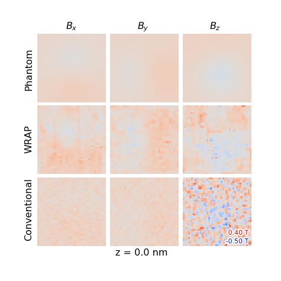

.. image:: https://app.travis-ci.com/grlewis333/WRAP.svg?branch=main
    :target: https://app.travis-ci.com/grlewis333/WRAP

.. image:: https://readthedocs.org/projects/wrap/badge/?version=latest
    :target: https://wrap.readthedocs.io/en/latest/?badge=latest
    :alt: Documentation Status

WRAP
====
WRAP is an improved reconstruction algorithm for magnetic electron tomography data.

To install and use WRAP, please ensure your device has a CUDA-enabled graphics card. We recommned using conda to manage packages, two installation options include:

* Create your conda environment using the provided .yml file by downloading the file and typing :code:`conda env create -f WRAP_env.yml` (this yml is configured for Windows)

* Add the necessary modules to your own environment by typing :code:`conda install -c conda-forge -c astra-toolbox -c numba -c anaconda astra-toolbox=1.8.3 jupyterlab jupyter_client=7.1.0 jupyter_server=1.13.1 numpy scipy matplotlib scikit-image numba cython pywavelets jupyterlab_widgets ipympl ipywidgets`, followed by :code:`pip install libertem --ignore-installed --user`

Basic use of WRAP is demonstrated in the WRAP_demo.ipynb python notebook.

If using WRAP for published work, please cite the following 2 papers:

* Lewis, G., Ringe, E., & Midgley, P. (2022). Imaging Nanomagnetism in 3D: Potential Improvements for Vector Electron Tomography Reconstruction. Microscopy and Microanalysis, 28(S1), 2572-2574. `doi:10.1017/S1431927622009801`_

.. _doi:10.1017/S1431927622009801: https://www.cambridge.org/core/journals/microscopy-and-microanalysis/article/imaging-nanomagnetism-in-3d-potential-improvements-for-vector-electron-tomography-reconstruction/EFC9214DCB1FA2C0CA7B99ACF030A147

* Lewis, G., et al. (2022). WRAP: A Compressed Sensing Reconstruction Algorithm for Magnetic Vector Electron Tomography. Ultramicroscopy, [In preparation]
